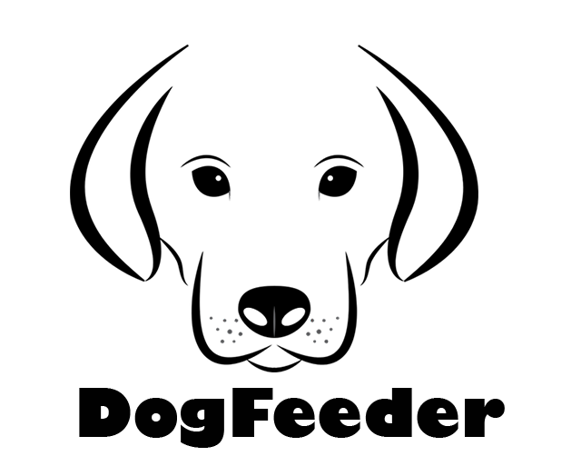

<h1>DOGFEEDER</h1>
<!-- -->

1. [Introducción](#introducción)
2. [Modelo 3D](#modelo3d)
3. [Puesta en Marcha Servicio TCP](#puesta-en-marcha)
    - [Instalación de Raspberry OS](#instalación-de-raspberry-os)
    - [Instalación de MySQL](#instalación-de-mysql)
    - [Servidor FTP](#servidor-ftp)
    - [Definición de Variables de Entorno](#definición-de-variables-de-entorno)
4. [Cliente TCP. Android app](#clienteTCP)    

## Introducción

 __¿Qué es DOGFEEDER?__
 Es un proyecto bajo la filosofía de IoT para la creación de un dispensador de alimento para perros a través de una aplicación móvil comunicada mediante socket TCP.

 __¿Con qué propósito se realiza?__

<b>DOGFEEDER</b> se realiza para cubrir el módulo de proyecto del CFGS DAM IoT 

## Modelo 3D
[TODO COMPLETE THIS]

## Puesta en Marcha

[TODO COMPLETE THIS]

### Instalación de Raspberry OS

[TODO COMPLETE THIS]

### Instalación de MySQL
[TODO COMPLETE THIS]

## Cliente TCP. Android app